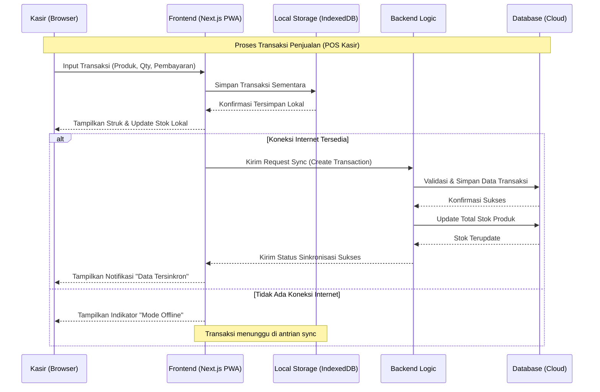
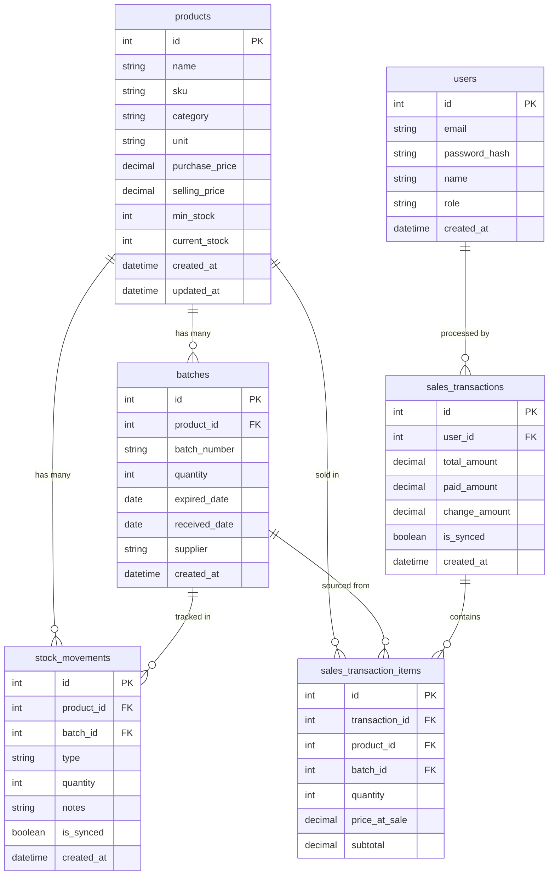

# PRD — Project Requirements Document

## 1. Overview
Aplikasi ini bertujuan untuk mendigitalkan operasional apotek yang mencakup **pencatatan stok obat (masuk/keluar)** dan **transaksi penjualan (Point of Sale/Kasir)** dalam satu sistem terintegrasi. Masalah utama yang ingin diselesaikan adalah kesulitan melacak stok obat secara real-time, memantau obat mendekati tanggal kadaluarsa, serta mencatat riwayat transaksi penjualan dan pergerakan stok secara akurat.

Tujuan utama aplikasi adalah menyediakan platform berbasis web yang digunakan secara internal di apotek, dengan kemampuan **tetap berjalan tanpa koneksi internet (offline-first)** untuk transaksi kasir, serta menyediakan akses pemantauan data dari jarak jauh bagi pemilik apotek (Owner) melalui sinkronisasi data ke cloud.

## 2. Requirements
Berikut adalah persyaratan tingkat tinggi untuk pengembangan sistem:
- **Aksesibilitas:** Aplikasi berbasis Web Browser, dijalankan di satu unit komputer kasir/admin di apotek.
- **Ketersediaan Offline:** Modul POS Kasir dan pencatatan stok harus tetap dapat digunakan meski tanpa koneksi internet, dengan data tersimpan sementara secara lokal dan tersinkronisasi otomatis ke server cloud saat koneksi tersedia kembali.
- **Pengguna:** Sistem dirancang untuk dua peran pengguna:
  - **Kasir/Admin** — akses penuh (input transaksi, kelola stok & produk) di lokasi apotek.
  - **Owner** — akses pemantauan (lihat dashboard, laporan stok & penjualan) dari jarak jauh.
- **Data Input:** Input data dilakukan secara manual (diketik) maupun melalui pemindaian barcode (opsional, untuk mempercepat transaksi kasir).
- **Spesifisitas Data:** Setiap obat harus mencatat informasi mendetail seperti Nomor Batch dan Tanggal Kadaluarsa (Expired Date).
- **Notifikasi:** Peringatan stok rendah (Low Stock Alert) dan peringatan obat mendekati kadaluarsa (Near-Expiry Alert) ditampilkan secara visual di halaman Dashboard.

## 3. Core Features
Fitur-fitur kunci yang harus ada dalam versi pertama (MVP):

1.  **Dashboard Utama**
    - Ringkasan total jumlah produk, nilai aset stok, dan total penjualan harian.
    - **Panel Peringatan Stok:** Daftar obat yang jumlahnya di bawah batas minimum.
    - **Panel Peringatan Kadaluarsa:** Daftar obat yang mendekati atau sudah melewati tanggal kadaluarsa.
2.  **Manajemen Produk (Master Data Obat)**
    - Tambah, Edit, dan Hapus Produk.
    - Kolom wajib: Nama Obat, SKU/Kode Obat, Kategori, Satuan, Harga Beli, Harga Jual, dan Minimum Stok.
3.  **Pencatatan Stok Masuk (Inbound)**
    - Form untuk menambah stok dari supplier/distributor.
    - Input: Pilih Produk, Jumlah, **Nomor Batch**, **Tanggal Kadaluarsa**, Tanggal Masuk, dan Supplier.
4.  **POS Kasir / Pencatatan Stok Keluar (Outbound)**
    - Form transaksi penjualan: pilih/scan produk, jumlah, otomatis memilih batch (FIFO berdasarkan tanggal kadaluarsa terdekat), hitung total & kembalian, cetak struk.
    - Stok berkurang otomatis begitu transaksi disimpan.
5.  **Mode Offline & Sinkronisasi Data**
    - Transaksi kasir dan pencatatan stok tetap dapat disimpan secara lokal saat tidak ada koneksi internet.
    - Indikator status koneksi (online/offline) ditampilkan di aplikasi.
    - Data otomatis tersinkronisasi ke server cloud saat koneksi kembali tersedia, tanpa duplikasi data.
6.  **Laporan Riwayat (Movement Logs & Laporan Penjualan)**
    - Tabel yang mencatat siapa (Kasir/Admin), kapan, obat apa, dan berapa jumlah yang masuk/keluar.
    - Laporan penjualan harian/mingguan/bulanan yang dapat diakses Owner secara remote.

## 4. User Flow
Alur kerja sederhana bagi pengguna saat menggunakan aplikasi:

1.  **Login:** Kasir/Admin masuk menggunakan email dan password.
2.  **Monitoring:** Kasir/Admin melihat Dashboard untuk mengecek stok menipis atau obat mendekati kadaluarsa.
3.  **Setup Produk (Awal):** Jika obat baru, Admin membuat data produk baru lengkap dengan kategori dan harga.
4.  **Update Stok:**
    - Jika obat datang dari supplier: Admin membuka menu "Stok Masuk", mengetik jumlah, nomor batch, dan tanggal kadaluarsa, lalu simpan.
    - Jika ada penjualan: Kasir membuka menu "POS Kasir", memilih/scan produk, mengetik jumlah, lalu memproses pembayaran.
5.  **Transaksi Offline (jika terjadi):** Jika internet terputus saat transaksi, sistem tetap menyimpan transaksi secara lokal dan menampilkan indikator "Mode Offline".
6.  **Verifikasi & Sinkronisasi:** Sistem otomatis memperbarui sisa stok, mencatat transaksi di riwayat, dan menyinkronkan data ke cloud saat koneksi tersedia.
7.  **Pemantauan Jarak Jauh:** Owner login dari luar apotek untuk melihat dashboard, laporan stok, dan laporan penjualan secara real-time (saat data sudah tersinkron).

## 5. Architecture
Berikut adalah gambaran arsitektur sistem dan aliran data secara teknis namun sederhana:

## 6. Database Schema

Berikut adalah Entity Relationship Diagram (ERD) yang menggambarkan struktur database utama:

| Tabel | Deskripsi |
|-------|-----------|
| **products** | Master data obat, menyimpan info SKU, kategori, satuan, harga, dan batas stok minimum |
| **batches** | Mencatat setiap batch masuk per produk dengan nomor batch unik dan tanggal kadaluarsa |
| **stock_movements** | Log semua transaksi masuk/keluar stok, terhubung ke produk dan batch |
| **sales_transactions** | Header transaksi penjualan (POS), mencatat total, pembayaran, dan status sinkronisasi |
| **sales_transaction_items** | Detail item per transaksi penjualan, terhubung ke produk dan batch yang terjual |
| **users** | Data pengguna (Kasir/Admin dan Owner) yang memiliki akses ke sistem |

## 7. Design & Technical Constraints
Bagian ini mengatur batasan teknis dan panduan desain yang harus dipatuhi tanpa mendikte pemilihan library secara spesifik.

1.  **High-Level Technology:**
    Sistem harus dibangun menggunakan teknologi modern yang mendukung pengembangan cepat (rapid development), kemudahan pemeliharaan (maintainability), dan mendukung kapabilitas **offline-first** (misalnya melalui PWA dengan local storage/IndexedDB). Pengembang dibebaskan memilih tools yang tepat selama tidak terikat pada stack spesifik secara kaku, namun tetap memprioritaskan performa dan skalabilitas untuk penggunaan skala kecil hingga menengah, serta mekanisme sinkronisasi data yang andal (menghindari duplikasi atau kehilangan data).

2.  **Typography Rules:**
    Sistem antarmuka (UI) wajib menggunakan konfigurasi font variable sebagai berikut untuk menjaga konsistensi visual:
    -   **Sans:** `Geist Mono, ui-monospace, monospace`
    -   **Serif:** `serif`
    -   **Mono:** `JetBrains Mono, monospace`
